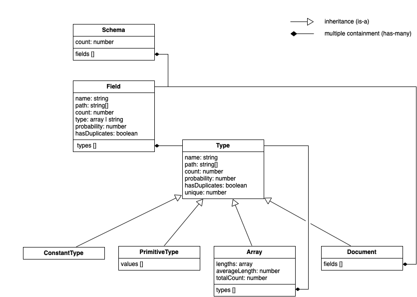

# mongodb-schema

[](http://travis-ci.org/mongodb-js/mongodb-schema)
[](https://coveralls.io/r/mongodb-js/mongodb-schema)
[](https://gitter.im/mongodb-js/mongodb-js?utm_source=badge&utm_medium=badge&utm_campaign=pr-badge&utm_content=badge)

Infer a probabilistic schema for a MongoDB collection.

## Example

`mongodb-schema` doesn't do anything directly with `mongodb` so to try the examples so we'll install the node.js driver.  As well, we'll need some data
in a collection to derive the schema of:

1. `npm i mongodb mongodb-schema`.
2. `mongo --eval "db.test.insert([{_id: 1, a: true}, {_id: 2, a: 'true'}, {_id: 3, a: 1}, {_id: 4}])" localhost:27017/test`
3. Paste the below into `parse-schema.js`:
  ```javascript
  var parseSchema = require('mongodb-schema');
  var connect = require('mongodb');

  connect('mongodb://localhost:27017/test', function(err, db){
    if(err) return console.error(err);

    parseSchema('test.test', db.collection('test').find(), function(err, schema){
      if(err) return console.error(err);

      console.log(JSON.stringify(schema, null, 2));
      db.close();
    });
  });
  ```
4. When we run the above with `node parse-schema.js`, we'll see something
  like the following:
  
  ```json
  {
    "//": "The number of documents sampled",
    "count": 4,
    "//": "A collection of Field objects",
    "//": "@see lib/field.js",
    "fields": [
      {
        "_id": "_id",
        "//": "Just as we expected, all 4 documents had `_id`",
        "probability": 1,
        "//": "All 4 values for `_id` were unique",
        "unique": 4,
        "//": "The only type seen was a Number",
        "types": [
          {
            "_id": "Number",
            "probability": 1,
            "unique": 4
          }
        ]
      },
      {
        "_id": "a",
        "//": "Unlike `_id`, `a` was present in only 3 of 4 documents",
        "probability": 0.75,
        "//": "Of the 3 values seen, all 3 were unique",
        "unique": 3,
        "//": "As expected, Boolean, String, and Number values were seen",
        "//": "A handy instance of `Undefined` is also provided to represent missing data",
        "types": [
          {
            "_id": "Boolean",
            "probability": 0.25,
            "unique": 1
          },
          {
            "_id": "String",
            "probability": 0.25,
            "unique": 1
          },
          {
            "_id": "Number",
            "probability": 0.25,
            "unique": 1
          },
          {
            "_id": "Undefined",
            "probability": 0.25,
            "unique": 0
          }
        ]
      }
    ]
  }
  ```

### More Examples

`mongodb-schema` is quite powerful and supports all [BSON types][bson-types].
Checkout [the tests][tests] for more usage examples.


## Installation

```
npm install --save mongodb-schema
```

## Testing

```
npm test
```

## License

Apache 2.0

## Contributing

Under the hood, `mongodb-schema` uses [ampersand-state][ampersand-state] and
[ampersand-collection][ampersand-collection] for modeling [Schema][schema], [Field][field]'s, and [Type][type]'s.

A high-level view of the class interactions is as follows:




[bson-types]: http://docs.mongodb.org/manual/reference/bson-types/
[ampersand-state]: http://ampersandjs.com/docs#ampersand-state
[ampersand-collection]: http://ampersandjs.com/docs#ampersand-collection
[tests]: https://github.com/mongodb-js/mongodb-schema/tree/master/test
[schema]: https://github.com/mongodb-js/mongodb-language-model/blob/master/lib/schema.js
[field]: https://github.com/mongodb-js/mongodb-language-model/blob/master/lib/field.js
[type]: https://github.com/mongodb-js/mongodb-language-model/blob/master/lib/type.js
